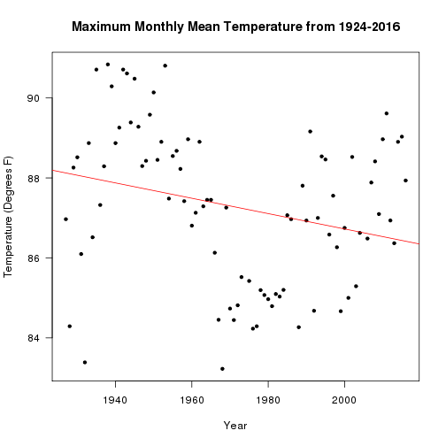
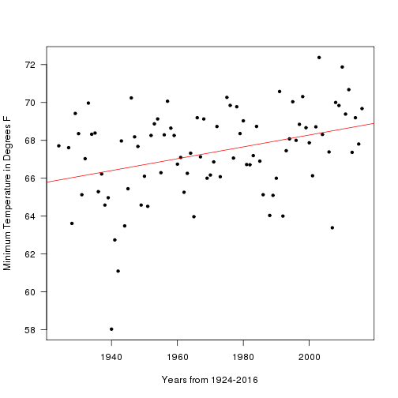

### Intro:

Monroe County, Florida is a largely coastal community where tourism, coastal infrastructure, and freshwater access are fundamental to economic and social well being. The Intergovernmental Panel Climate Change (IPCC) asserts that environmental hazards stemming from rising temperature such as increased flood risk, sea level rise, etc threaten the economic and social well being of Southern Florida. The demand for tourism in Southern Florida will decrease as biodiversity in the Everglades is reduced from salt water intrusion and coastal infrastructure is destroyed by more severe weather events. The IPCC links these negative environmental hazards to rising temperatures. In an attempt to understand the reasoning behind these claims, I investigated, analyzed, and visually presented trends in local temperature data of Monroe County.

###Methods:

I downloaded data freely available from NOAA (National Oceanic and Atmospheric Administration) via a weather station in Monroe County (Everglades), Florida. I used RStudio software to summarize, evaluate, and graphically present the data. When processing the data, I filtered out obvious outliers, created a linear model, and developed a trendline. I analyzed maximum and minimum temperatures (Fahrenheit) by month from 1924 to 2016 to account for daily and seasonal fluctuations in temperature. 

I am determining a trend between time and temperature using the null hypothesis method, a standard scientific convention. The null hypothesis states that there is no relationship between temperature and time. The alternative hypothesis states that there is a relationship between temperature and time. Therefore, if the probability value (p-value) calculated is less than .05, the null hypothesis is considered violated and a relationship can be assumed.

###**Results:**


####**Example of maximum temperature data for the month of May**
May was chosen for the example because there is a trend for both maximum and minimum values (null hypothesis is violated). Temperature is measured in degrees Fahrenheit.



The change or slope is -1.9 degress/100 years  with a probability value of .02. Since the probability is less than .05, we can reject the null hypothesis and there is a trend.


####**Table of Slopes (degrees/100 years) and P-values for maximum temp:**

```
##           Slope P-Value
## January   -3.86 <.01   
## February  -3.62 0.01   
## March     -2.02 0.09   
## April     -3.8  <.01   
## May       -1.92 0.02   
## June      -1.7  0.049  
## July      -1.36 0.02   
## August    -1.91 <.01   
## September -1.38 0.02   
## October   0.31  0.69   
## November  -0.1  0.92   
## December  -0.29 0.83
```


####**Analysis of maximum temperature values:**

January, February, April, May, June, July, August, September(8/12 months) violate the null hypothesis. If the null hypothesis is violated, a negative relationship (as time passes tmax decreases) since 1924 is assumed. While my analysis of the data in the area shows cooling based on the maximum temperature values since 1924, saying that this data invalidates claims that net warming on a global level is causing the melting of land ice and thermal exapnsion of the ocean leading to increased sea level would be a hasty generalization. This data is coming from one weather station in the Everglades of Monroe County. Even though max temperatures in the local area are cooling, the global temperature as reported by the IPCC is increasing which contributes to the melting of ice in from large on land icesheets such as that in Greenland. 

Now we will examine the minimum monthly temperatures examined across the various months to see if there is a trend. The criteria for noting a trend if the null hypothesis is violated still stands. If the p-value is less than .05 the null hypothesis is violated. 


####**Example of minimum temperature data for the month of May**
May was chosen for the example because there is a trend for both maximum and minimum temperature values (null hypothesis is violated).Temperature is measured in degrees Fahrenheit.




In this case, we get a slope, 3 degress/ 100 years and a probability of <.01.  Since the p-value is less than .05, the null hypothesis is violated and there is a trend. 


####**Table of Slopes (degrees/100 years) and P-values for minimum temperature:**

```
##           Slope P-Value
## January   -1.9  .26    
## February  -.44  .79    
## March     1.34  .36    
## April     .99   .38    
## May       3.13  <.01   
## June      3.16  <.01   
## July      -1.73 .61    
## August    2.5   <.01   
## September 2.36  <.01   
## October   1.44  .15    
## November  2.04  .11    
## December  2.97  .08
```
####**Analysis of minimum temperature values:**

Out of the 12 months, 4 months (May, June, August, and September) violate the null hypothesis meaning that there is a positive trend between time and minimum temperature.Therefore the range of the temperature values (Range=maximum value-minimum value) is decreasing as the maximum value is cooling/decreasing and the minimum value is warming/increasing. The reduced temperature range could impact amphibean reproduction and agricultural productivity.

###**Conclusion- Reconciling Temperature Data with Environmental Problems Facing Monroe County:**

My analysis of local temperature data seems inconsistent to claims made by the IPCC asserting that the regional climate change models predict that air temperature in southern Florida will rise 3-5 degrees F by the end of the century (Piccinni 2017). However, the tail end of maximum temperature climate graphs indicate an upward slope to the latter half of the 20th century and early 21st century which suggests their claims likely still stands. While local temperature is not alarming for the health and safety of the people and economy of South Florida, it would be a hasty generalization to assert that climate change in other parts of the globe as reported by the IPCC does not pose an immediate threat to the economy and lives of Southern Florida residents. Relevant temperature changes of interest are those around the ice sheet of Greenland. As temperatures rise in Greenland, land ice will continue to melt into oceans, causing global sea level rise which will effect coast lines such as that of Southern Florida. The rising sea levels pose a strong threat to Florida’s tourism industry. In 2005, nearly 86 million tourists visited Florida, generating $63 billion in revenue, which is roughly 10% of Florida’s economic output (FSU 2017). The biodiversity that attracts many tourists will be threatened as minimum temperature rises. Reduction of freeze events will result in mangroves moving northward, relplacing salt marshes in some areas (NOAA 2017). Increased brackishness or saltiness of plant available water from rising sea levels will lead to species decline as well (Saha, 2011).

Florida’s unique flatness of land will not mitigate the inland movement of the water. A one-foot rise in sea level is predicted to cause anywhere from 2000-10,000 feet on inland movement (FSU 2017). Salt water intrusion from rising sea levels will contaminate Florida’s water supply, damage coastal infrastructure, and reduce biodiversity. Existing infrastructure will be at increased risk of damage for the three following reasons: increase of storm surge elevations (more powerful storms), rising sea levels, and progressively eroding and lowering dune elevations (NOAA 2017). If the saline water front moves far enough north, Miami-Dade County’s water supply could be comprimised as well (NOAA 2017). Storm impacts will also be exacerbated. FSU researchers found that changes in sea level could increase damage costs of storms from 10-40%. The increased intensity of storms and flooding will result in not only increased economic cost, but also result in lost lives. Ultimately, Floridians need to think about changing temperatures not simply on a local level, but a global one to understand the threats to their economy and livelihood.


**Works Cited:**

Piccininni, Frank. "Adaptation to Climate Change and the Everglades Ecosystem." Scholarly Commons. N.p., 2013. Web. 12 Feb. 2017.  

"Climate Change: Impact of Sea Level Rise." (n.d.): n. pag. NOAA. Florida Ocean Council, Dec. 2010. Web. 12 Feb. 2017.

Climate Change in Coastal Florida: Economic Impacts of Sea Level Rise (n.d.): n. pag. Bipartisan Policy. Florida State University. Web. 12 Feb. 2017.

Saha, Amartya K., Sonali Saha, Jimi Sadle, Jiang Jiang, Michael S. Ross, René M. Price, Leonel S. L. O. Sternberg, and Kristie S. Wendelberger. "Sea Level Rise and South Florida Coastal Forests." Climatic Change 107.1-2 (2011): 81-108. Web. 12 Feb. 2017.

Blog formatted using R
