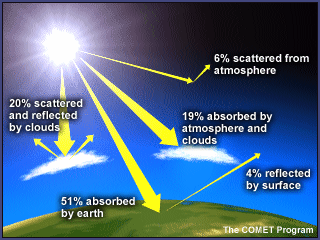
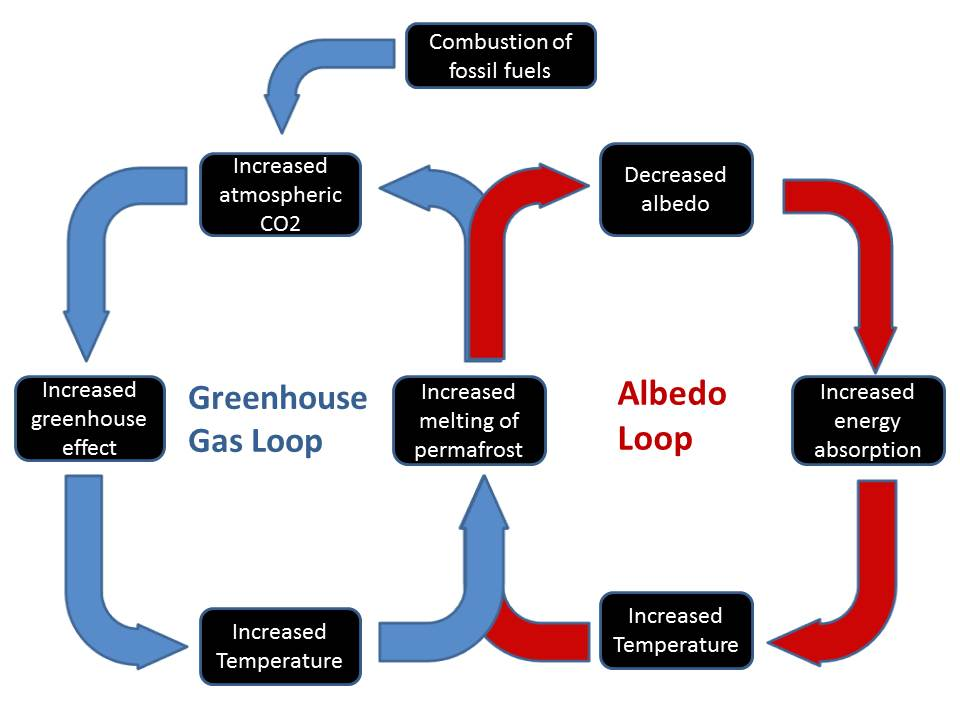

Climate Review
========================================================
author: Caroline Smith
date: 
autosize: true
font-family: 'century gothic'

Positive and Negative Feedback Loops
========================================================

Feedback Loops: an event triggers another and so on until the first event is affected again
- two types, positive and negative
- positive feedback loops: change results in the same type of change
- negative feedback loops: change results in the opposite type of change

Feedback loops essential to earth systems (eg. panic as a positive, glucose levels as a negative)
- with climate change, feedback loops are being affected and amplifying the effects

Greenhouse Gases
========================================================

When light comes down from the sun:
- ~25% is scattered or reflected by the clouds and the atmosphere
- ~51% comes down to earth and is absorbed 
- ~4% is reflected through albedo
- ~20% is absorbed by the atmosphere
Light coming down into the atmosphere and the earth converted into heat
- molecules in the atmosphere absorb and re-rediate the heat

===
***

Greenhouse Gases and Positive Feedback
========================================================

Positive feedback loop is created
- 1. greenhouse gas is released into atmosphere
- 2. sunlight reaches the atmosphere and earth, converted to infrared
- 3. heat then stays in the atmosphere instead of being released
- 4. more greenhouse gases and sunlight enter the atmosphere

Natural systems in balance with the amount of heat in atmosphere
- negative feedback loop of processes that control amounts of gases in atmosphere

Specific Greenhouse Gases: Carbon Dioxide
========================================================

Svante Arrhenius found doubling the CO2 in atmosphere would produce warming effect up to 4°C
- negative feedback loop of photosynthesis and respiration
- emissions from combustion of fossil fuels and deforestation create a disproportionate amount of CO2 in the atmosphere
- very abundant greenhouse gas

Positive feedback loop:
- CO2 heats up the atmosphere
- increases the frequency of combustion (eg. wildfires) and respiration
- CO2 levels increase and more heat is absorbed

Specific Greenhouse Gases: Methane
========================================================

Methane produced when organic matter decomposes without contacting air
- Volatile Organic Compound
- common source is melting permafrost layers when trapped underground
- less abundant than CO2 but 21 times the heat carrying capacity

Positive Feedback Loop:
- Methane heats up the atmosphere
- Permafrost melts releasing Methane Hydrate; Oceans warm causing methane bubbles to rise
- Heat speeds up processes of decomposition
- More methane is released

Specific Greenhouse Gases: Water Vapor
========================================================

Water vapor most abundant warming substance in atmosphere
- amplifies the warming of other substances
- depletes the environment of water as liquid and ice: droughts, dehydration

Positive Feedback Loop:
- Global warming causes water to evaporate
- Evaporating water creates droughts and reduces ice (and ice-albedo)
- Evap. water also makes combustions more likely--> CO2
- Humidity increases the effectiveness of other GHGs, causing more warming
- Humidity also increases amount of decomp. --> methane

The Effects of Clouds
========================================================

Clouds both increase and decrease atmospheric heat
- low altitude water droplet clouds mostly reflect light, so they cool
- high altitude ice crystal clouds absorb and trap heat, so they warm
- positive feedback loop with 80% certainty, similar to that of water vapor
- negative feedback loop of albedo not significant enough to equilibrate

The Effect of Ice-Albedo
========================================================

- about 4% of all sunlight reflected by ice masses

Positive Feedback Loop:
- climate change causes ice to melt
- less ice means more sunlight is absorbed by earth as heat
- warming oceans make contact with ice, more melts
- sea level rise covers land, evaporates into water vapor

The Interconnected Feedback Loop
========================================================
Many of the feedback loops influence each other
- GHGs cause initial increase in atmospheric heat retention
- warming causes more GHGs to be released, water vapor (condenses into clouds), ice melt
- more GHGs are released through human activity

What to do? Regulate!
- natural processes such as evaporation, condensation, and ice melt cannot be regulated
- causes for those can such as human caused GHG emissions

=====

***

